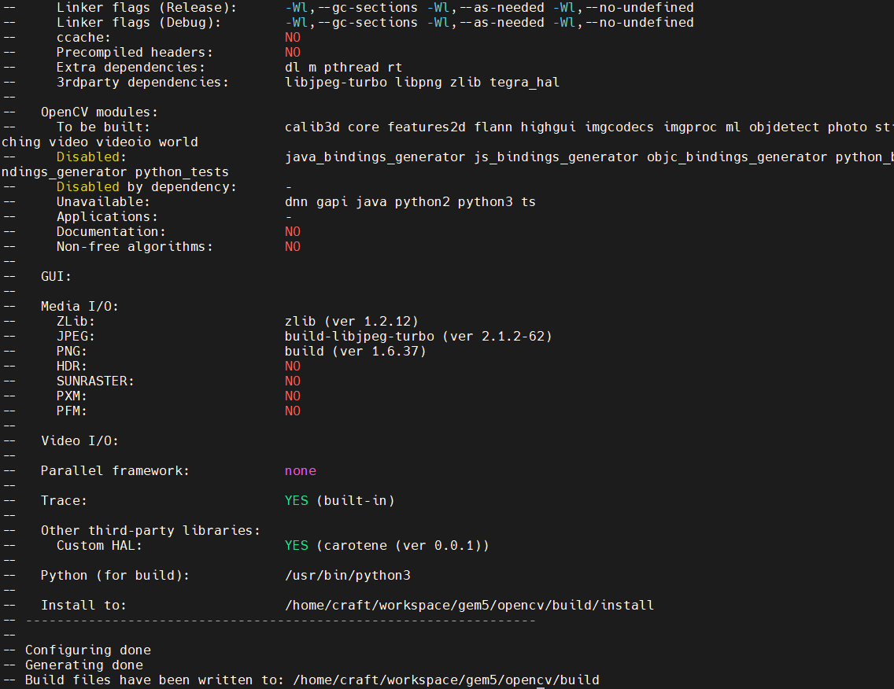

# Home
## Cheat Sheet
This Cheat Sheet contains all commands to run a tflite demo in gem5 fs mode.

## Get Started
Follow these instructions to download all the required materials, build a gem5 binary and run simple examples in both System Call Emulation (SE) and Full System (FS) modes.

## Get GEM5
- Follow this [tutorial](https://www.gem5.org/getting_started/) to build a excutable gem5 binary.
- We use the v22.0.0.1 version.

## Simulate Arm in gem5

### SE Simulation

#### Run simple SE:
```
$ ./build/ARM/gem5.opt configs/example/arm/starter_se.py --cpu="minor" "tests/test-progs/hello/bin/arm/linux/hello" _# Hello world!_
```
#### Run multicore SE:

Note: each core runs its own program
```
$ ./build/ARM/gem5.opt configs/example/arm/starter_se.py --cpu="minor" --num-cores=2 "tests/test-progs/hello/bin/arm/linux/hello" "tests/test-progs/hello/bin/arm/linux/hello"
```
### FS Simulation

Get an Arm full system disk image from the gem5 downloads page, and set $M5_PATH:

> Note: the download URLs and filenames below are examples, and may change as new binaries are released by the gem5 project. Please also use a suitable $M5_PATH of your choice.
```
$ export M5_PATH="${PWD}/../m5_binaries"

$ mkdir -p "${M5_PATH}"

$ wget -P "${M5_PATH}" http://dist.gem5.org/dist/v22-0/arm/aarch-system-20220707.tar.bz2

$ tar -xjf "${M5_PATH}/aarch-system-20210904.tar.bz2" -C "${M5_PATH}"

$ wget -P "${M5_PATH}/disks" http://dist.gem5.org/dist/v22-0/arm/disks/ubuntu-18.04-arm64-docker.img.bz2

$ bunzip2 "${M5_PATH}/disks/ubuntu-18.04-arm64-docker.img.bz2"

$ echo "export M5_PATH=${M5_PATH}" >> ~/.bashrc
```
#### Run simple FS with disk image:
```
$ ./build/ARM/gem5.opt configs/example/arm/starter_fs.py --cpu="minor" --num-cores=1 \
          --disk-image=$M5_PATH/disks/ubuntu-18.04-arm64-docker.img  --root-device=/dev/vda1
```
#### Create a checkpoint after boot:
```
$ telnet localhost 3456

$ m5 checkpoint
```
> Note: 3456 is the default port number used by the gem5 simulator. If this does not work, the correct port number can be found in the gem5 output:

system.terminal: Listening for connections on port 3456

A more modern alternative is to use the m5term utility provided with gem5.

#### Restore from a checkpoint:

> Note: Arm starter_fs.py allows you to specify checkpoints with --restore=m5out/cpt.TICKNUMBER/. Make sure the --num-cores and --disk-image arguments are the same as the original simulation; the --cpu type may be changed.
```
$ ./build/ARM/gem5.opt configs/example/arm/starter_fs.py --restore=m5out/cpt.TICKNUMBER/ --cpu="minor" --num-cores=1 --disk-image=$M5_PATH/disks/ubuntu-18.04-arm64-docker.img --root-device=/dev/vda1
```
## FS Benchmarks

### Get and Compile OpenCV

Install ccmake
```
$ sudo apt-get install cmake-curses-gui
```
Install the Arm cross compiler toolchain
```
$ sudo apt install gcc-aarch64-linux-gnu g++-aarch64-linux-gnu binutils-aarch64-linux-gnu
```

Download OpenCV 4.6.0:
```
$ wget https://github.com/opencv/opencv/archive/refs/tags/4.6.0.tar.gz
$ tar -xvzf opencv-4.6.0.tar.gz && cd opencv-4.6.0
$ mkdir build && cd build && ccmake -DCMAKE_TOOLCHAIN_FILE=../platforms/linux/aarch64-gnu.toolchain.cmake ..
```
We build the opencv world static library


```
$ make -j install
```

### Get and Compile TFLITE

- Follow this [tutorial](https://www.tensorflow.org/lite/guide/build_cmake) to build a static tensorflow-lite library.
- We use the v2.9.1 version.

### Cross-Compile Demo on x86

[link](../README)

### Run TFLITE demo
To run TFLITE demo on Arm, we need to enlarge the disk image and copy the directory of compiled demo to it. Then, we need to pass the demo runscripts via the --script option to the simulation script starter_fs.py.

### Copy classification to Disk Image

#### Expand and resize the disk image:
```
$ cp ubuntu-18.04-arm64-docker.img expanded-ubuntu-18.04-arm64-docker.img

$ dd if=/dev/zero bs=1G count=20 >> ./expanded-ubuntu-18.04-arm64-docker.img # add 20G zeros

$ sudo parted expanded-ubuntu-18.04-arm64-docker.img resizepart 1 100% # grow partition 1
```
#### Mount the expanded disk image, resize the filesystem, and copy PARSEC to it:

#### In order to mount the disk image, we must calculate the offset of the first partition.

#### Run fdisk to find the start offset (in sectors) and the sector size (in bytes) of the partition.
```
$ fdisk -l expanded-ubuntu-18.04-arm64-docker.img
```
Disk expanded-ubuntu-18.04-arm64-docker.img: 21.9 GiB, 23474836480 bytes, 45849290 sectors

Units: sectors of 1 * 512 = 512 bytes

Sector size (logical/physical): 512 bytes / 512 bytes

I/O size (minimum/optimal): 512 bytes / 512 bytes

Disklabel type: dos

Disk identifier: 0x93d4895b

Device                                  Boot Start      End  Sectors  Size Id Type

expanded-ubuntu-18.04-arm64-docker.img1        128 45849289 45849162 21.9G 83 Linux

#### In this example  the start offset (in sectors) is 128 and the sector size (in bytes) is 512, giving a start offset of 128x512=65536 bytes.

#### Now mount the disk image, resize the filesystem, and copy PARSEC.

> Note: set /path_to_compiled_parsec-3.0_dir/, and change 32256 to the offset in bytes calculted above
```
$ mkdir disk_mnt

$ sudo mount -o loop,offset=65536 expanded-ubuntu-18.04-arm64-docker.img disk_mnt

$ df # find /dev/loopX for disk_mnt

$ sudo resize2fs /dev/loopX # resize filesystem

$ df # check that the Available space for disk_mnt is increased

$ mkdir -p disk_mnt/root/tflite

$ sudo cp -r classification/ disk_mnt/root/tflite # copy the compiled tflite_classification demo and the other files to the image

$ sudo ls disk_mnt/root/tflite/classification # check the demo contents

$ sudo umount disk_mnt
```
### Run classification on HPI

We only show how to run classification on the HPI model. Reading results from stats.txt files can be done by using the read_results.sh script, as shown for the SE mode.

#### benchmark runscripts

[link](../scripts/run_classification.sh)

#### Run starter_fs using the expanded image and benchmark runscript

$ ./build/ARM/gem5.opt -d fs_results/<benchmark> configs/example/arm/starter_fs.py --cpu="hpi" --num-cores=1 --disk-image=$M5_PATH/disks/expanded-ubuntu-18.04-arm64-docker.img --root-device=/dev/vda1 --script=../scripts/run_classification.sh
